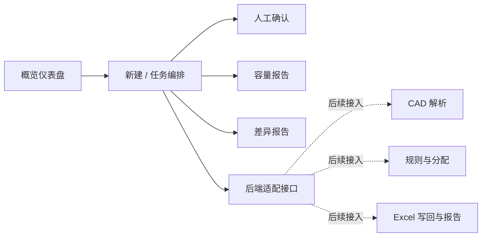

# 工业 I/O 接口智能编排系统 GUI 设计

## 1. 目标与范围

在 `src/main_gui.py` 创建一个可直接启动的 Flet 桌面界面，作为工业 I/O 接口智能编排系统的用户交互入口。初版先交付两个可打磨的页面：工程概览和任务编排；其余流程作为后续导航入口预留。界面应呈现项目建议书规定的完整工程流程，但本阶段不实现 CAD/DXF 解析、规则推理、Excel 写回或报告导出算法。

本阶段交付的是真实可交互的界面：用户可以选择本地文件、创建任务、在页面间切换、查看受控的任务状态和示例数据、处理人工确认项、查看容量/差异报告，并能从页面明确看见后续业务脚本的接入位置。应用不得声称已完成实际工程分配或改写输入 Excel 文件。

不在范围内：DWG/DXF 内容读取、OCR、Excel 单元格写入、规则文件解析、持久化、并发任务、用户权限及实际报告文件导出。

## 2. 用户与成功标准

目标用户为负责工业控制系统设计的工程人员。用户在首次打开程序时应能理解从输入图纸和点表到复核、容量检查、报告输出的流程；在不接入任何后端脚本的情况下，所有交互均不报错，文件选择、任务状态、确认状态和页面统计彼此一致。

成功标准：

- `python src/main_gui.py` 能启动 Flet 应用。
- 首页明确展示任务数、已分配、待确认、容量风险四类摘要。
- 新建任务页能选择 CAD/DXF、Excel、规则文件，并阻止缺少 CAD 或 Excel 时启动编排。
- 用户能在概览与任务编排两个优先页面间切换，并能看见人工确认、容量报告、差异报告的后续入口。
- 所有执行/导出操作都明确显示“接口预留，等待业务脚本接入”，不产生工程输出文件。

## 3. 界面信息架构



左侧固定导航包含系统名称、任务状态、两个可用功能入口、三个“后续版本”入口和底部版本信息。主内容区采用浅灰背景、白色卡片、深蓝标题和蓝色主操作按钮；绿色表示正常/完成，橙色表示待确认，红色表示容量风险或未分配。数据页采用卡片摘要 + 结构化表格，使其具有工程控制台而非通用办公应用的视觉层级。

## 4. 页面与交互

### 概览仪表盘

展示当前演示任务的状态、输入文件名或“尚未选择”、四张关键指标卡片、最近处理步骤以及流程说明。点击“创建编排任务”跳转到任务编排页。

### 任务编排

提供三个文件选择区：CAD/DXF 图纸、Excel I/O 点表、规则配置文件（可选）。选择后仅保留本地路径和文件名。点击“开始预检”时：若 CAD 或 Excel 缺失，在页面展示具体缺项；若齐备，任务状态变为“预检通过（接口待接入）”，并展示固定的六步流程：图纸识别、测点标准化、信号分类、去重、20% 冗余分配、增量写入。

“执行编排”不调用任何脚本，而是打开/展示接口预留提示，并把任务日志追加为等待后端服务。该约束避免在尚无解析引擎时产生误导性的工程数据。

### 人工确认（后续入口）

以数据表显示 TE 类型不明、疑似重复、通道异常等示例项，包含测点名称、问题、建议类型、状态和操作。用户为每项选择 DI、DO、AI、AO、TC 或 RTD 后点击确认，状态转换为“已确认”，待确认指标减少。该状态仅保存在进程内。

### 容量报告（后续入口）

展示每张卡件的总通道、80% 可用上限、当前占用、可用数、使用率及风险状态。以 16、8、32 通道卡示例说明每卡独立的 `floor(总通道 * 0.8)` 规则。高于上限或异常的行标红，接近上限的行标橙。页面说明数据目前为界面样例，后续由通道分配器提供。

### 差异报告（后续入口）

展示成功写入、待确认、疑似重复、未分配四类统计及变更表。导出按钮仅反馈“报告导出接口已预留”，不创建文件。页面在视觉上对应文档要求的工程复核和追溯入口。

## 5. 组件与接入边界

为保持本阶段单文件易运行，同时避免未来将 UI 与业务逻辑耦合，`main_gui.py` 划分为以下职责清晰的 Python 对象：

- `TaskState`：进程内任务、文件路径、日志和示例结果的状态模型。
- `BackendAdapter`：后端边界；当前方法返回“未接入”状态，未来由 CAD 解析、规则引擎、通道分配、Excel 导出模块替换实现。
- `IndustrialOrchestrationApp`：Flet 页面配置、导航、视图构建和事件处理。

适配器预留以下调用方向：

```text
parse_cad(cad_path) -> 标准测点列表
classify_signals(points, rules_path) -> I/O 信号与待确认项
allocate_channels(signals, excel_path) -> 分配结果与容量数据
export_workbook(allocation, excel_path) -> 输出文件与差异报告
```

上述接口在本阶段只以类型/状态提示体现，不读取或写入业务文件。未来脚本接入时应保持 UI 事件与返回数据边界不变。

## 6. 可靠性与失败处理

- 文件路径为空、文件类型不符或文件不存在时，任务编排页给出可理解的提示，且不进入预检通过状态。
- Flet 文件选择器不可用或用户取消选择时，保留当前状态且不抛出未捕获异常。
- 所有尚未接入的操作以信息提示和日志说明其状态；不使用“完成”“已写入”等成功语义。
- 后续适配器发生异常时，UI 应捕获异常，显示错误摘要并记录任务日志，而不使应用退出。
- 不上传、外传或修改用户选择的 CAD/Excel 文件。

## 7. 技术决策（ADR 摘要）

### ADR-001：使用 Flet 构建本地桌面 GUI

**状态：已接受。** 项目虚拟环境已具备 Python 3.12.9 和 Flet 0.86.5。Flet 可在不引入 Web 服务和前端构建链的前提下创建跨平台桌面界面，适合当前原型。

备选方案：PySide6 可提供更细的桌面控件能力，但项目未安装且会增加依赖；Web 前端可扩展性更强，但需要额外后端和部署。选择 Flet 优先降低首版交付与后续 Python 脚本集成成本。

### ADR-002：先建立 UI 适配器边界，不伪实现业务逻辑

**状态：已接受。** 当前 `src` 下的业务模块为空，直接在 GUI 中模拟 CAD 或 Excel 处理将混淆原型与工程结果。使用 `BackendAdapter` 将界面与未来脚本分开，界面可以完整演示流程，且数据安全和工程可信度不受影响。

代价是首版只能展示样例数据及接口状态；收益是避免错误修改点表，未来可按既定接口替换后端实现。

### ADR-003：将首版实现维持在单一 GUI 文件

**状态：已接受。** 用户明确指定 `src/main_gui.py`，项目尚无可复用实现。首版以一文件组织，但用状态模型、适配器和视图构造方法分段；当后端接入或页面复杂度增加时，可平滑拆分到 `src/ui/` 包。

## 8. 测试策略

在实现前先为无 Flet 依赖的状态与适配器行为编写 pytest 测试：输入校验、80% 容量计算、人工确认状态变更和未接入后端反馈。随后测试各个视图构造函数能够创建控件，不依赖真实文件对话框或图形窗口。最后通过启动应用进行人工烟雾验证。

## 9. 验收清单

- [ ] 使用项目 `.venv` 的 Python 3.12 运行 GUI。
- [ ] Flet 窗口展示工程风格概览页与侧边导航。
- [ ] 工程概览与任务编排页面均可访问且无未处理异常。
- [ ] 文件预检可交互；人工确认、容量和报告以明确的后续入口呈现。
- [ ] 后端未接入操作显式提示，不改写任何输入文件。
- [ ] 自动化测试覆盖状态和适配器的可观察行为。
